<h1 align="center">
Startup Investments
</h1>

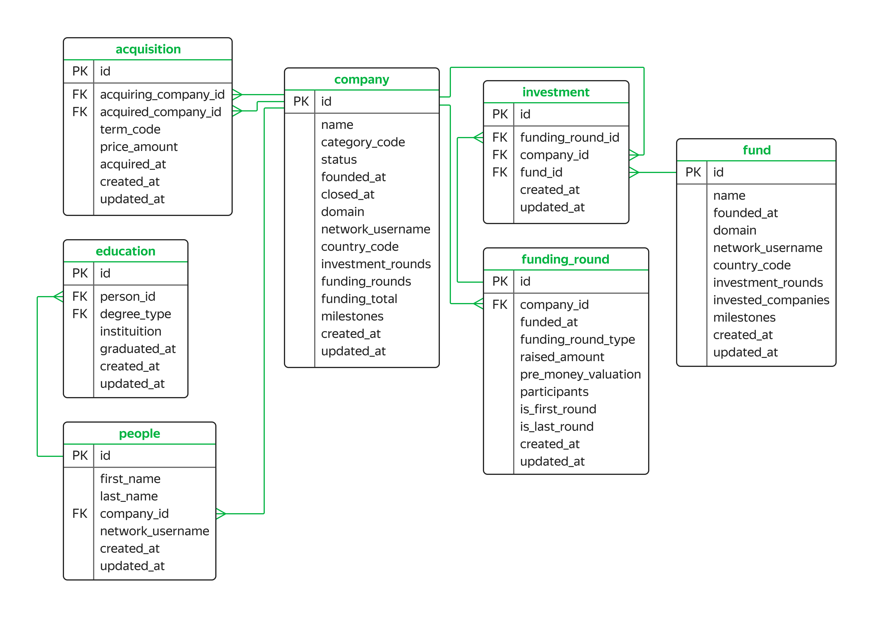

## Проект: Анализ рынка инвестиций в стартапы

**Описание:**

Данный проект представляет собой базу данных, содержащую информацию о венчурных фондах и инвестициях в компании-стартапы. В проекте представлена работа с базой данных в СУБД **PostgreSQL**. База данных основана на датасете **Startup Investments**, опубликованном на платформе **Kaggle**.

**Цель проекта:**

Познакомиться с основами анализа рынка инвестиций в стартапы, изучить структуру базы данных и провести собственное исследование.

**Основные концепции:**

* **Венчурные фонды:** Финансовые организации, инвестирующие в стартапы с высокой рискованностью и потенциалом для значительной прибыли.
* **Стартапы:** Компании, созданные с целью разработки и реализации инновационных бизнес-идей или технологий.
* **Раунды финансирования:** Этапы привлечения инвестиций, соответствующие этапам развития стартапа:
    * **Предпосевной раунд:** Инвестиции на стадии замысла компании.
    * **Посевной раунд:** Инвестиции на стадии разработки бизнес-модели.
    * **Ангельский раунд:** Инвестиции от бизнес-ангелов, которые предлагают экспертную помощь.
    * **Раунд A, B, C, D:** Инвестиции на этапах активного развития и подготовки к IPO.
    * **Венчурный раунд:** Инвестиции от венчурного фонда на любом этапе.

**Структура базы данных:**

База данных состоит из 8 таблиц, связанных между собой внешними ключами:

* **acquisition:** Информация о покупках одних компаний другими.
* **company:** Информация о компаниях-стартапах.
* **education:** Информация об уровне образования сотрудников компаний.
* **fund:** Информация о венчурных фондах.
* **funding_round:** Информация о раундах инвестиций.
* **investment:** Информация об инвестициях венчурных фондов в компании-стартапы.
* **people:** Информация о сотрудниках компаний-стартапов.

**Описание таблиц:**

**acquisition:**

* `id` (первичный ключ): Идентификатор покупки.
* `acquiring_company_id` (внешний ключ): Идентификатор компании-покупателя.
* `acquired_company_id` (внешний ключ): Идентификатор компании, которую покупают.
* `term_code`: Способ оплаты сделки (cash, stock, cash_and_stock).
* `price_amount`: Сумма покупки в долларах.
* `acquired_at`: Дата совершения сделки.
* `created_at`: Дата и время создания записи.
* `updated_at`: Дата и время обновления записи.

**company:**

* `id` (первичный ключ): Идентификатор компании.
* `name`: Название компании.
* `category_code`: Категория деятельности компании.
* `status`: Статус компании (acquired, operating, ipo, closed).
* `founded_at`: Дата основания компании.
* `closed_at`: Дата закрытия компании.
* `domain`: Домен сайта компании.
* `network_username`: Профиль компании в корпоративной сети.
* `country_code`: Код страны.
* `investment_rounds`: Количество инвестиционных раундов, в которых компания участвовала.
* `funding_rounds`: Количество раундов, в которых компания привлекала инвестиции.
* `funding_total`: Сумма привлечённых инвестиций.
* `milestones`: Количество важных этапов в истории компании.
* `created_at`: Дата и время создания записи.
* `updated_at`: Дата и время обновления записи.

**education:**

* `id` (первичный ключ): Идентификатор записи об образовании.
* `person_id` (внешний ключ): Идентификатор человека.
* `degree_type`: Учебная степень.
* `instituition`: Учебное заведение.
* `graduated_at`: Дата завершения обучения.
* `created_at`: Дата и время создания записи.
* `updated_at`: Дата и время обновления записи.

**fund:**

* `id` (первичный ключ): Идентификатор венчурного фонда.
* `name`: Название фонда.
* `founded_at`: Дата основания фонда.
* `domain`: Домен сайта фонда.
* `network_username`: Профиль фонда в корпоративной сети.
* `country_code`: Код страны фонда.
* `investment_rounds`: Количество инвестиционных раундов, в которых фонд участвовал.
* `invested_companies`: Количество компаний, в которые инвестировал фонд.
* `milestones`: Количество важных этапов в истории фонда.
* `created_at`: Дата и время создания записи.
* `updated_at`: Дата и время обновления записи.

**funding_round:**

* `id` (первичный ключ): Идентификатор инвестиционного раунда.
* `company_id` (внешний ключ): Идентификатор компании.
* `funded_at`: Дата проведения раунда.
* `funding_round_type`: Тип инвестиционного раунда.
* `raised_amount`: Сумма инвестиций, привлечённых компанией.
* `pre_money_valuation`: Предварительная оценка стоимости компании.
* `participants`: Количество участников раунда.
* `is_first_round`: Является ли этот раунд первым для компании.
* `is_last_round`: Является ли этот раунд последним для компании.
* `created_at`: Дата и время создания записи.
* `updated_at`: Дата и время обновления записи.

**investment:**

* `id` (первичный ключ): Идентификатор инвестиции.
* `funding_round_id` (внешний ключ): Идентификатор раунда инвестиции.
* `company_id` (внешний ключ): Идентификатор компании-стартапа.
* `fund_id` (внешний ключ): Идентификатор фонда, инвестирующего в компанию.
* `created_at`: Дата и время создания записи.
* `updated_at`: Дата и время обновления записи.

**people:**

* `id` (первичный ключ): Идентификатор сотрудника.
* `first_name`: Имя сотрудника.
* `last_name`: Фамилия сотрудника.
* `company_id` (внешний ключ): Идентификатор компании-стартапа.
* `network_username`: Профиль сотрудника в корпоративной сети.
* `created_at`: Дата и время создания записи.
* `updated_at`: Дата и время обновления записи.


## Запрос №1
**Описание:**

Отобразите все записи из таблицы `company` по компаниям, которые закрылись.

<table>
<thead>
<tr><td>Code<td>Result</tr>
</thead>
<tbody>
<tr>
<td>

```sql
SELECT *
FROM company
WHERE status = 'closed';
```
<td>  
   
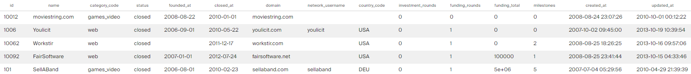
</tr>
</tbody>
</table>

## Запрос №2
**Описание:**

Отобразите количество привлечённых средств для новостных компаний США. Используйте данные из таблицы `company`. Отсортируйте таблицу по убыванию значений в поле `funding_total`.

<table>
<thead>
<tr><td>Code<td>Result</tr>
</thead>
<tbody>
<tr>
<td>

```sql
SELECT funding_total
FROM company
WHERE country_code = 'USA'
      AND category_code = 'news'
ORDER BY funding_total DESC;
```
<td>  
   
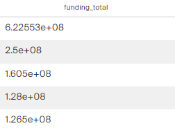
</tr>
</tbody>
</table>

## Запрос №3
**Описание:**

Найдите общую сумму сделок по покупке одних компаний другими в долларах. Отберите сделки, которые осуществлялись только за наличные с 2011 по 2013 год включительно.

<table>
<thead>
<tr><td>Code<td>Result</tr>
</thead>
<tbody>
<tr>
<td>

```sql
SELECT SUM(price_amount)
FROM acquisition
WHERE EXTRACT(YEAR FROM CAST(acquired_at AS DATE)) BETWEEN 2011 AND 2013
      AND term_code = 'cash';
```
<td>  
   
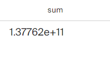
</tr>
</tbody>
</table>

## Запрос №4
**Описание:**

Отобразите имя, фамилию и названия аккаунтов людей в поле `network_username`, у которых названия аккаунтов начинаются на `Silver`.

<table>
<thead>
<tr><td>Code<td>Result</tr>
</thead>
<tbody>
<tr>
<td>

```sql
SELECT first_name,
       last_name,
       network_username
FROM people
WHERE network_username LIKE 'Silver%';
```
<td>  
   
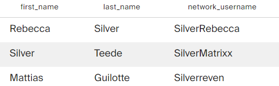
</tr>
</tbody>
</table>

## Запрос №5
**Описание:**

Выведите на экран всю информацию о людях, у которых названия аккаунтов в поле `network_username` содержат подстроку `money`, а фамилия начинается на `K`.

<table>
<thead>
<tr><td>Code<td>Result</tr>
</thead>
<tbody>
<tr>
<td>

```sql
SELECT *
FROM people
WHERE network_username LIKE '%money%'
      AND last_name LIKE 'K%';
```
<td>  
   
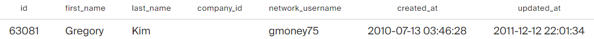
</tr>
</tbody>
</table>

## Запрос №6
**Описание:**

Для каждой страны отобразите общую сумму привлечённых инвестиций, которые получили компании, зарегистрированные в этой стране. Страну, в которой зарегистрирована компания, можно определить по коду страны. Отсортируйте данные по убыванию суммы.

<table>
<thead>
<tr><td>Code<td>Result</tr>
</thead>
<tbody>
<tr>
<td>

```sql
SELECT country_code,
       SUM(funding_total)
FROM company
GROUP BY country_code
ORDER BY SUM(funding_total) DESC;
```
<td>  
   
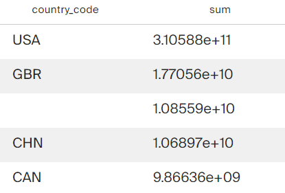
</tr>
</tbody>
</table>

## Запрос №7
**Описание:**

Составьте таблицу, в которую войдёт дата проведения раунда, а также минимальное и максимальное значения суммы инвестиций, привлечённых в эту дату.
Оставьте в итоговой таблице только те записи, в которых минимальное значение суммы инвестиций не равно нулю и не равно максимальному значению.

<table>
<thead>
<tr><td>Code<td>Result</tr>
</thead>
<tbody>
<tr>
<td>

```sql
SELECT CAST(funded_at AS DATE) AS date_amount,
       MIN(raised_amount),
       MAX(raised_amount)
FROM funding_round
GROUP BY date_amount
HAVING MIN(raised_amount) != 0 
      AND MIN(raised_amount) != MAX(raised_amount);
```
<td>  
   
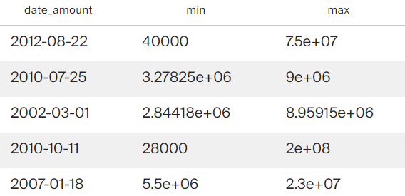
</tr>
</tbody>
</table>

## Запрос №8
**Описание:**

Создайте поле с категориями:
* Для фондов, которые инвестируют в 100 и более компаний, назначьте категорию `high_activity`.
* Для фондов, которые инвестируют в 20 и более компаний до 100, назначьте категорию `middle_activity`.
* Если количество инвестируемых компаний фонда не достигает 20, назначьте категорию `low_activity`.
Отобразите все поля таблицы `fund` и новое поле с категориями.

<table>
<thead>
<tr><td>Code<td>Result</tr>
</thead>
<tbody>
<tr>
<td>

```sql
SELECT *,
    (CASE
        WHEN invested_companies >= 100 THEN 'high_activity'
        WHEN invested_companies < 20  THEN 'low_activity'
        ELSE 'middle_activity'
    END) AS category
FROM fund;
```
<td>  
   
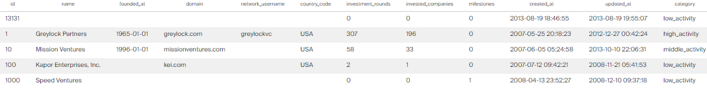
</tr>
</tbody>
</table>

## Запрос №9
**Описание:**

Для каждой из категорий, назначенных в предыдущем задании, посчитайте округлённое до ближайшего целого числа среднее количество инвестиционных раундов, в которых фонд принимал участие. Выведите на экран категории и среднее число инвестиционных раундов. Отсортируйте таблицу по возрастанию среднего.

<table>
<thead>
<tr><td>Code<td>Result</tr>
</thead>
<tbody>
<tr>
<td>

```sql
SELECT data.activity AS category,
       ROUND(AVG(data.investment_rounds)) AS avg_rounds
FROM
    (SELECT *,
           CASE
               WHEN invested_companies>=100 THEN 'high_activity'
               WHEN invested_companies>=20 THEN 'middle_activity'
               ELSE 'low_activity'
           END AS activity
    FROM fund) AS data
GROUP BY category
ORDER BY avg_rounds;
```
<td>  
   
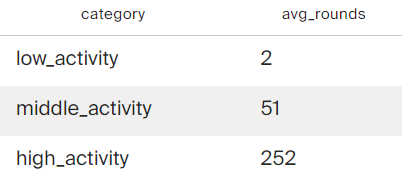
</tr>
</tbody>
</table>

## Запрос №10
**Описание:**

Проанализируйте, в каких странах находятся фонды, которые чаще всего инвестируют в стартапы. 
Для каждой страны посчитайте минимальное, максимальное и среднее число компаний, в которые инвестировали фонды этой страны, основанные с 2010 по 2012 год включительно. Исключите страны с фондами, у которых минимальное число компаний, получивших инвестиции, равно нулю. 
Выгрузите десять самых активных стран-инвесторов: отсортируйте таблицу по среднему количеству компаний от большего к меньшему. Затем добавьте сортировку по коду страны в лексикографическом порядке.

<table>
<thead>
<tr><td>Code<td>Result</tr>
</thead>
<tbody>
<tr>
<td>

```sql
SELECT country_code AS country,
    MIN(invested_companies) AS min_invested,
    MAX(invested_companies) AS max_invested,
    AVG(invested_companies) AS avg_invested
FROM fund
WHERE (EXTRACT(YEAR FROM CAST(founded_at AS DATE)) BETWEEN 2010 AND 2012)
GROUP BY country
HAVING MIN(invested_companies) != 0
ORDER BY avg_invested DESC, 
    country
LIMIT 10;
```
<td>  
   
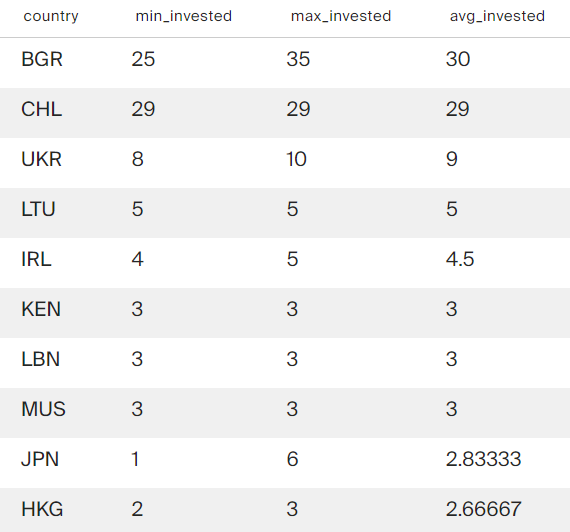
</tr>
</tbody>
</table>

## Запрос №11
**Описание:**

Отобразите имя и фамилию всех сотрудников стартапов. Добавьте поле с названием учебного заведения, которое окончил сотрудник, если эта информация известна.

<table>
<thead>
<tr><td>Code<td>Result</tr>
</thead>
<tbody>
<tr>
<td>

```sql
SELECT p.first_name,
    p.last_name,
    e.instituition
FROM people AS p 
LEFT JOIN education AS e ON p.id = e.person_id;
```
<td>  
   
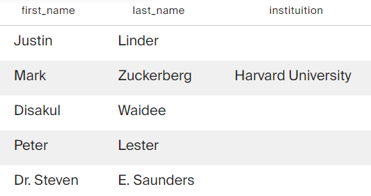
</tr>
</tbody>
</table>

## Запрос №12
**Описание:**

Для каждой компании найдите количество учебных заведений, которые окончили её сотрудники. Выведите название компании и число уникальных названий учебных заведений. Составьте топ-5 компаний по количеству университетов.

<table>
<thead>
<tr><td>Code<td>Result</tr>
</thead>
<tbody>
<tr>
<td>

```sql
SELECT c.name,
       COUNT(DISTINCT(instituition))
FROM company AS c 
JOIN people AS p ON c.id = p.company_id
JOIN education AS e ON  p.id = e.person_id
GROUP BY c.name
ORDER BY COUNT(DISTINCT(instituition)) DESC
LIMIT 5;
```
<td>  
   
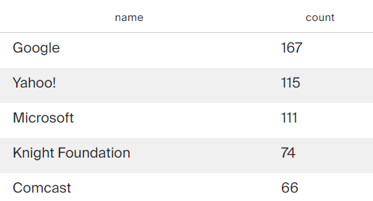
</tr>
</tbody>
</table>

## Запрос №13
**Описание:**

Составьте список с уникальными названиями закрытых компаний, для которых первый раунд финансирования оказался последним.

<table>
<thead>
<tr><td>Code<td>Result</tr>
</thead>
<tbody>
<tr>
<td>

```sql
SELECT DISTINCT(name)
FROM company
WHERE status = 'closed' 
    AND id IN (SELECT company_id
    FROM funding_round
    WHERE is_first_round = 1
    AND is_last_round = 1);
```
<td>  
   
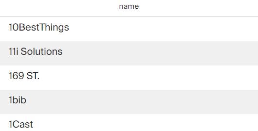
</tr>
</tbody>
</table>

## Запрос №14
**Описание:**

Составьте список уникальных номеров сотрудников, которые работают в компаниях, отобранных в предыдущем задании.

<table>
<thead>
<tr><td>Code<td>Result</tr>
</thead>
<tbody>
<tr>
<td>

```sql
SELECT DISTINCT(p.id)
FROM people AS p
WHERE p.company_id IN (SELECT id
    FROM company
    WHERE status = 'closed' 
        AND id IN (SELECT company_id
        FROM funding_round
        WHERE is_first_round = 1
        AND is_last_round = 1));
```
<td>  
   
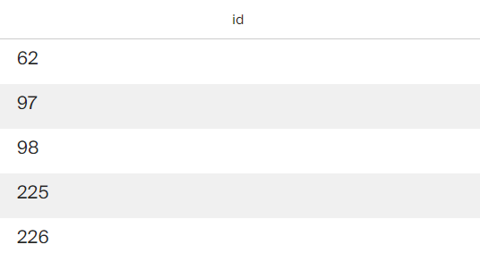
</tr>
</tbody>
</table>

## Запрос №15
**Описание:**

Составьте таблицу, куда войдут уникальные пары с номерами сотрудников из предыдущей задачи и учебным заведением, которое окончил сотрудник.

<table>
<thead>
<tr><td>Code<td>Result</tr>
</thead>
<tbody>
<tr>
<td>

```sql
SELECT DISTINCT(p.id)
FROM people AS p
WHERE p.company_id IN (SELECT id
    FROM company
    WHERE status = 'closed' 
        AND id IN (SELECT company_id
        FROM funding_round
        WHERE is_first_round = 1
        AND is_last_round = 1));
```
<td>  
   
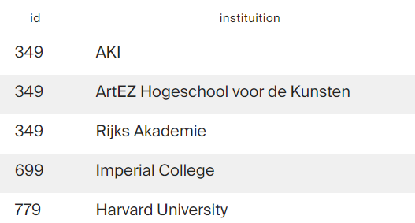
</tr>
</tbody>
</table>

## Запрос №16
**Описание:**

Посчитайте количество учебных заведений для каждого сотрудника из предыдущего задания. При подсчёте учитывайте, что некоторые сотрудники могли окончить одно и то же заведение дважды.

<table>
<thead>
<tr><td>Code<td>Result</tr>
</thead>
<tbody>
<tr>
<td>

```sql
WITH
df AS (SELECT DISTINCT(p.id)
    FROM people AS p
    WHERE p.company_id IN (SELECT id
        FROM company
        WHERE status = 'closed' 
            AND id IN (SELECT company_id
            FROM funding_round
            WHERE is_first_round = 1
            AND is_last_round = 1)))

SELECT df.id,
    COUNT(e.instituition)
FROM df
JOIN education AS e ON df.id = e.person_id
GROUP BY df.id;
```
<td>  
   
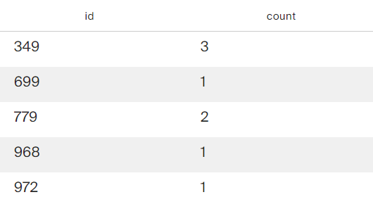
</tr>
</tbody>
</table>

## Запрос №17
**Описание:**

Дополните предыдущий запрос и выведите среднее число учебных заведений (всех, не только уникальных), которые окончили сотрудники разных компаний. Нужно вывести только одну запись, группировка здесь не понадобится.

<table>
<thead>
<tr><td>Code<td>Result</tr>
</thead>
<tbody>
<tr>
<td>

```sql
WITH 
fr AS (SELECT company_id
       FROM   funding_round
       WHERE  is_first_round = 1
       AND    is_last_round = 1), 

p AS (SELECT DISTINCT p.id
      FROM   people AS p
      WHERE  p.company_id IN (SELECT DISTINCT c.id
                              FROM   company AS c
                              JOIN   fr ON fr.company_id = c.id
                              WHERE  c.status = 'closed')), 

pe AS (SELECT p.id,
              COUNT(e.instituition)
       FROM   education AS e
       JOIN   p ON p.id = e.person_id
       GROUP BY p.id) 

SELECT AVG(pe.count)
FROM   pe;;
```
<td>  
   
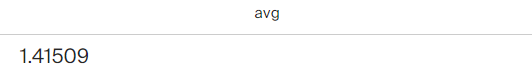
</tr>
</tbody>
</table>

## Запрос №18
**Описание:**

Дополните предыдущий запрос и выведите среднее число учебных заведений (всех, не только уникальных), которые окончили сотрудники разных компаний. Нужно вывести только одну запись, группировка здесь не понадобится.

<table>
<thead>
<tr><td>Code<td>Result</tr>
</thead>
<tbody>
<tr>
<td>

```sql
WITH 
fr AS (SELECT company_id
       FROM   funding_round), 

p AS (SELECT DISTINCT p.id
      FROM   people AS p
      WHERE  p.company_id IN (SELECT DISTINCT c.id
                              FROM   company AS c
                              JOIN   fr ON fr.company_id = c.id
                              WHERE  c.name LIKE '%Socialnet%')), 

pe AS (SELECT p.id,
              COUNT(e.instituition)
       FROM   education AS e
       JOIN   p ON p.id = e.person_id
       GROUP BY p.id) 

SELECT AVG(pe.count)
FROM   pe;
```
<td>  
   
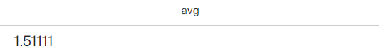
</tr>
</tbody>
</table>

## Запрос №19
**Описание:**

Составьте таблицу из полей:
* `name_of_fund` — название фонда;
* `name_of_company` — название компании;
* `amount` — сумма инвестиций, которую привлекла компания в раунде.
В таблицу войдут данные о компаниях, в истории которых было больше шести важных этапов, а раунды финансирования проходили с 2012 по 2013 год включительно.

<table>
<thead>
<tr><td>Code<td>Result</tr>
</thead>
<tbody>
<tr>
<td>

```sql
WITH
fr AS (SELECT*
    FROM funding_round
    WHERE funded_at BETWEEN '2012-01-01' AND '2013-12-31')

SELECT f.name AS name_of_fund,
c.name AS name_of_company,
fr.raised_amount AS amount
FROM investment AS i
LEFT JOIN company AS c ON c.id = i.company_id
LEFT JOIN fund AS f ON i.fund_id = f.id
INNER JOIN fr ON fr.id = i.funding_round_id
WHERE c.milestones > 6;
```
<td>  
   
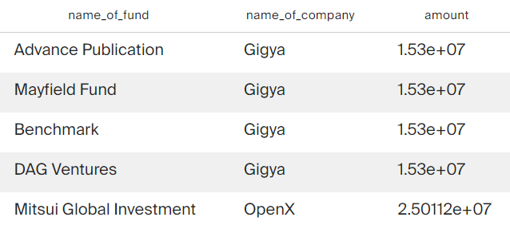
</tr>
</tbody>
</table>

## Запрос №20
**Описание:**

Выгрузите таблицу, в которой будут такие поля:
* название компании-покупателя;
сумма сделки;
* название компании, которую купили;
* сумма инвестиций, вложенных в купленную компанию;
* доля, которая отображает, во сколько раз сумма покупки превысила сумму вложенных в компанию инвестиций, округлённая до ближайшего целого числа.
Не учитывайте те сделки, в которых сумма покупки равна нулю. Если сумма инвестиций в компанию равна нулю, исключите такую компанию из таблицы. 
Отсортируйте таблицу по сумме сделки от большей к меньшей, а затем по названию купленной компании в лексикографическом порядке. Ограничьте таблицу первыми десятью записями.

<table>
<thead>
<tr><td>Code<td>Result</tr>
</thead>
<tbody>
<tr>
<td>

```sql
WITH
acquiring AS (SELECT a.id AS id,
        c.name,
        a.price_amount
    FROM acquisition AS a 
    LEFT JOIN company AS c ON a.acquiring_company_id = c.id
    WHERE a.price_amount != 0),

acquired AS (SELECT a.id AS id,
        c.name,
        c.funding_total
    FROM acquisition AS a 
    LEFT JOIN company AS c ON a.acquired_company_id = c.id
     WHERE c.funding_total != 0)
    
SELECT acquiring.name,
acquiring.price_amount,
acquired.name,
acquired.funding_total,
ROUND(acquiring.price_amount / acquired.funding_total)
FROM acquiring
JOIN acquired ON acquiring.id = acquired.id
ORDER BY acquiring.price_amount DESC, acquired.name
LIMIT 10;
```
<td>  
   
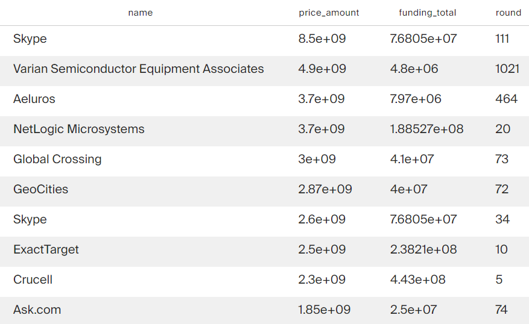
</tr>
</tbody>
</table>

## Запрос №21
**Описание:**

Выгрузите таблицу, в которую войдут названия компаний из категории `social`, получившие финансирование с 2010 по 2013 год включительно. Проверьте, что сумма инвестиций не равна нулю. Выведите также номер месяца, в котором проходил раунд финансирования.

<table>
<thead>
<tr><td>Code<td>Result</tr>
</thead>
<tbody>
<tr>
<td>

```sql
SELECT c.name,
    EXTRACT(MONTH FROM CAST(funded_at AS DATE))
FROM funding_round AS fr
LEFT JOIN company AS c ON fr.company_id = c.id
WHERE EXTRACT(YEAR FROM CAST(funded_at AS DATE)) BETWEEN 2010 AND 2013
    AND raised_amount != 0
    AND company_id IN (SELECT id
        FROM company AS c
        WHERE category_code = 'social');
```
<td>  
   
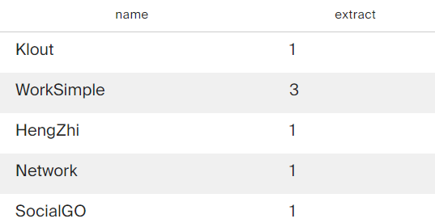
</tr>
</tbody>
</table>

## Запрос №22
**Описание:**

Отберите данные по месяцам с 2010 по 2013 год, когда проходили инвестиционные раунды. Сгруппируйте данные по номеру месяца и получите таблицу, в которой будут поля:
* номер месяца, в котором проходили раунды;
количество уникальных 
* названий фондов из США, которые инвестировали в этом месяце;
* количество компаний, купленных за этот месяц;
* общая сумма сделок по покупкам в этом месяце.

<table>
<thead>
<tr><td>Code<td>Result</tr>
</thead>
<tbody>
<tr>
<td>

```sql
WITH

ac AS (SELECT EXTRACT(MONTH FROM CAST(acquired_at AS DATE)) AS month_ac,
        COUNT(acquisition) AS count_ac,
        SUM(price_amount) AS sum_ac
    FROM acquisition
    WHERE EXTRACT(YEAR FROM CAST(acquired_at AS DATE)) BETWEEN 2010 AND 2013
    GROUP BY EXTRACT(MONTH FROM CAST(acquired_at AS DATE))),
    
fundings AS (SELECT EXTRACT(MONTH FROM CAST(fr.funded_at AS DATE)) AS funding_month,
    COUNT(DISTINCT f.id) AS us_funds
    FROM fund AS f
    LEFT JOIN investment AS i ON f.id = i.fund_id
    LEFT JOIN funding_round AS fr ON i.funding_round_id = fr.id
    WHERE f.country_code = 'USA'
    AND EXTRACT(YEAR FROM CAST(fr.funded_at AS DATE)) BETWEEN 2010 AND 2013
    GROUP BY funding_month)
    
SELECT fundings.funding_month AS month,
    fundings.us_funds,
    ac.count_ac,
    ac.sum_ac
FROM fundings 
LEFT JOIN ac ON fundings.funding_month = ac.month_ac
```
<td>  
   
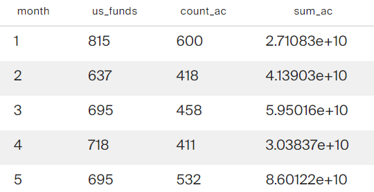
</tr>
</tbody>
</table>

## Запрос №23
**Описание:**

Составьте сводную таблицу и выведите среднюю сумму инвестиций для стран, в которых есть стартапы, зарегистрированные в 2011, 2012 и 2013 годах. Данные за каждый год должны быть в отдельном поле. Отсортируйте таблицу по среднему значению инвестиций за 2011 год от большего к меньшему.

<table>
<thead>
<tr><td>Code<td>Result</tr>
</thead>
<tbody>
<tr>
<td>

```sql
WITH
     inv_2011 AS (SELECT country_code AS country,
         AVG(funding_total) AS year_2011
     FROM company
     WHERE EXTRACT(YEAR FROM CAST(founded_at AS DATE)) BETWEEN 2011 AND 2013 
     GROUP BY country, EXTRACT(YEAR FROM CAST(founded_at AS DATE))
     HAVING EXTRACT(YEAR FROM CAST(founded_at AS DATE)) = 2011),
     
     inv_2012 AS (SELECT country_code AS country,
         AVG(funding_total) AS year_2012
     FROM company
     WHERE EXTRACT(YEAR FROM CAST(founded_at AS DATE)) BETWEEN 2011 AND 2013 
     GROUP BY country, EXTRACT(YEAR FROM CAST(founded_at AS DATE))
     HAVING EXTRACT(YEAR FROM CAST(founded_at AS DATE)) = 2012),
     
     inv_2013 AS (SELECT country_code AS country,
         AVG(funding_total) AS year_2013
     FROM company
     WHERE EXTRACT(YEAR FROM CAST(founded_at AS DATE)) BETWEEN 2011 AND 2013 
     GROUP BY country, EXTRACT(YEAR FROM CAST(founded_at AS DATE))
     HAVING EXTRACT(YEAR FROM CAST(founded_at AS DATE)) = 2013) 

SELECT inv_2011.country,
       inv_2011.year_2011,
       inv_2012.year_2012,
       inv_2013.year_2013
FROM inv_2011
INNER JOIN inv_2012 ON inv_2011.country = inv_2012.country
INNER JOIN inv_2013 ON inv_2012.country = inv_2013.country
ORDER BY inv_2011.year_2011 DESC
```
<td>  
   
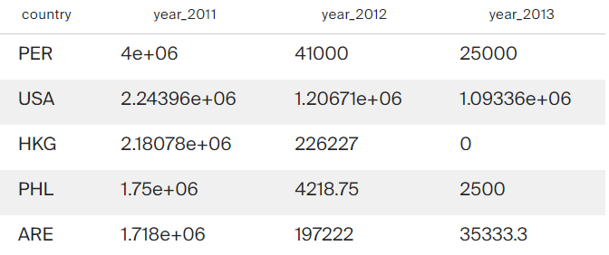
</tr>
</tbody>
</table>
